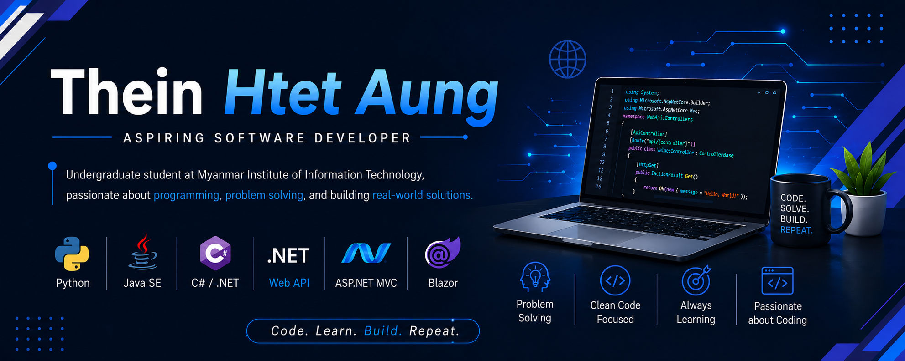

# 👋 Hi, I'm Thein Htet Aung

  

I am an undergraduate student at the **Myanmar Institute of Information Technology (MIIT)**, passionate about **programming, software development, and problem solving**. I have studied and practiced **Python**, **Java SE**, and **.NET**. I am especially interested in **Object-Oriented Programming (OOP)** and backend development using **ASP.NET Core Web API**, **ASP.NET MVC**, and **Blazor**.

---

## 👨‍💻 About Me

🎓 Undergraduate student at **Myanmar Institute of Information Technology**  
💻 Passionate about programming and problem solving  
🧠 Interested in software engineering and backend development  
🧩 Strong interest in Object-Oriented Programming  
⚙️ Currently focusing on the .NET ecosystem  
🚀 Always learning and improving through real-world projects  

---

## 🛠️ Technical Skills

**Programming Languages:** Python, Java SE, C#  
**.NET Technologies:** ASP.NET Core Web API, ASP.NET MVC, Blazor, Entity Framework Core  
**Core Concepts:** Object-Oriented Programming, REST API Development, MVC Architecture, Backend Development, Database Design Basics, Problem Solving, Clean Code Basics  
**Tools:** Git, GitHub, Visual Studio, Visual Studio Code, SQL Server, Postman  

---

## 🎯 Main Focus

My main focus is on becoming a better software developer by building real-world applications and understanding how software systems work. I am especially interested in backend development, database-connected systems, clean code, and software architecture fundamentals.

---

## 📖 Currently Learning

Advanced .NET development, Clean Architecture, Authentication and Authorization, Entity Framework Core, Database design, and real-world backend project structure.

---

## 🚀 Career Goal

My goal is to become a skilled software developer who can build reliable, maintainable, and useful applications. I want to keep improving my technical skills, work on meaningful projects, and contribute to real-world software solutions.

---

## 📫 Contact

**GitHub:** https://github.com/theinhtetaung-dev  
**LinkedIn:** https://www.linkedin.com/in/thein-htet-aung-22435a393/  
**Email:** theinhtetaung.developer@gmail.com
